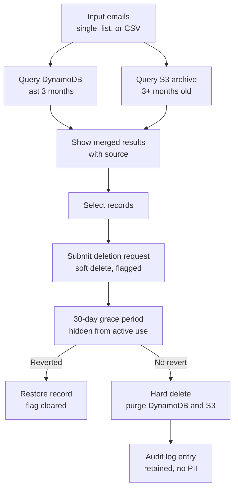
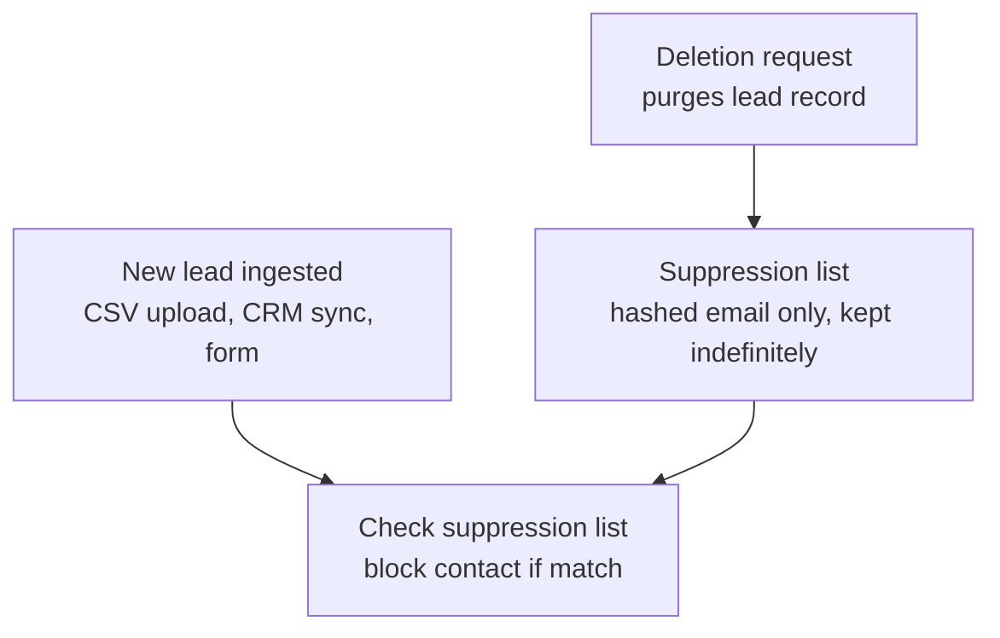

# Solution Outline: Email Search & Deletion Feature

## Overview

Add functionality to the existing lead routing platform allowing users to:

1. Input emails (single, list, or CSV)
2. Search across active (DynamoDB, last 3 months) and archived (S3, 3+ months) storage
3. Review matched records and select which to delete
4. Submit a deletion request with a 30-day grace period (revertible)
5. Handle interaction with the unsubscribe/suppression list correctly

---

## 1. Input Layer

Accept three input modes into one normalized pipeline:

- **Single email** — validated inline, immediate search
- **Email list** (pasted, comma/newline separated) — parsed client-side or server-side
- **CSV upload** — pushed to S3, parsed by a Lambda (handles large batches without blocking the UI)

All paths funnel into a normalized list: lowercase, trimmed, deduped, format-validated. Invalid rows are flagged back to the user (not silently dropped) for audit purposes.

For large CSVs, queue individual emails via SQS and process asynchronously with a job ID the user can poll, rather than a synchronous blocking search.

---

## 2. Search Layer

### DynamoDB (last 3 months — "hot" data)

Avoid table scans. Add a **GSI on email** so lookups are direct queries. If leads/records are keyed by lead ID and email is just an attribute, this GSI is what makes the feature viable at scale.

### S3 (3+ months — archived data)

Two options:

- **Lookup index** — a lightweight DynamoDB table (`email_hash → [S3 keys / archive dates]`) populated at archive-time. Gives O(1) lookup into S3 without scanning objects. Scales better for frequent use.
- **Amazon Athena** — query S3 directly with SQL if data is partitioned sensibly (e.g., by date). Simpler to build, slower per-query. Fine for low search volume.

### Aggregation

Merge DynamoDB + S3 results into one result set per email: source system, record type (lead record, campaign event, message log, etc.), date, and storage location. This is what's shown to the user before selection.

---

## 3. Deletion Workflow

- **Soft delete on submit**: flag the record (`pending_deletion: true`, `deletion_requested_at`, `scheduled_purge_date`). Data is hidden from active workflows (routing, campaigns, reporting) immediately, not physically removed.
- **Revert**: within 30 days, a "Pending Deletions" view lets the user (or admin) cancel — clears the flag, record returns to normal.
- **Hard delete**: an EventBridge scheduled job checks daily for requests past the 30-day mark and not reverted, then purges from DynamoDB and S3.
- **Audit trail**: keep a permanent record that a deletion happened (request ID, requester, timestamp, email hash — not the PII itself) even after the underlying data is purged. Most privacy regs (GDPR, CCPA) expect proof of deletion, so this record should survive the purge.

---

## 4. Unsubscribe & Suppression List Interaction

Deletion and unsubscribe are **not the same thing** and shouldn't be conflated:

- **Unsubscribe** = stop sending marketing communications. The email needs to stay on a **suppression list** indefinitely — otherwise a re-imported lead (new CSV, CRM sync, form fill) would have no record they opted out, and could get emailed again (a CAN-SPAM/CASL problem in itself).
- **Deletion request** = remove the underlying PII/record entirely.

The conflict: fully deleting someone's data also deletes the *evidence* that they unsubscribed.

**Standard pattern:**

- When a deletion request is processed, retain a minimal suppression entry (hashed email + "do not contact" flag, no other PII) separately from the deleted record.
- At lead-ingestion time (new CSV, form fill, CRM sync), check incoming emails against this suppression list and block/flag matches before they re-enter the routing pipeline.
- Make this explicit in the UI: *"This will remove the lead's data. They will remain on the do-not-contact list unless separately reactivated."*

This suppression list is effectively a **separate small system** from the main deletion workflow — small, durable, checked on ingest, and explicitly exempt from the same purge logic.

---

## Open Questions

- Does "revert" require admin approval, or can the original requester self-revert?
- Do transactional records (non-marketing) get the same deletion treatment, or are they exempt (many regs allow retaining data needed for legal/contractual obligations)?
- Is 30 days the *grace period before deletion*, or the *legal deadline to complete deletion*? (GDPR's "without undue delay and within one month" would mean the grace period eats into the compliance deadline, not sit on top of it.)
